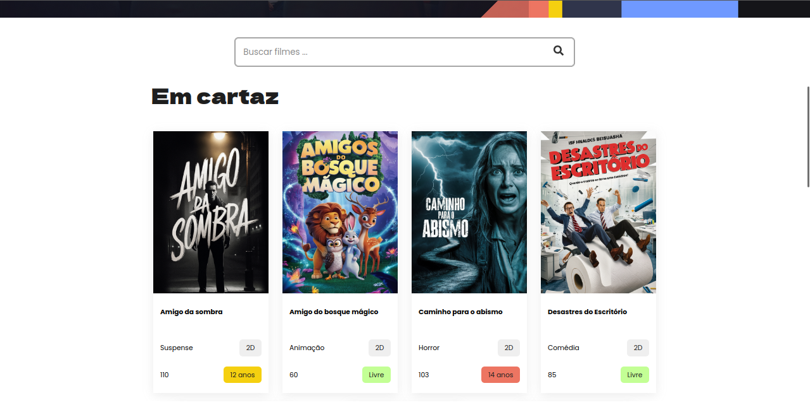
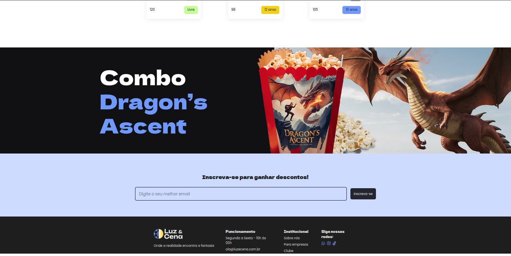

# Luz e Cena
Aplicação React para listar filmes em cartaz nos cinemas (Dados mockados).

# Como rodar
- Tenha o Node e npm instalados na sua máquina
 - Clone o porjeto
 - Abra o terminal na pasta do projeto execute os seguintes comandos:
    - `npm install`
    - `npm run dev`

- Abra outro terminal na pasta do projeto e execute:
   - `npm run server`

- Acesse o endereço `http://localhost:5173/` no navegador

# Seções da interface

## Cabeçalo e Banner

## Pesquisa e Listagem de filmes

## Inscrição e Rodapé

